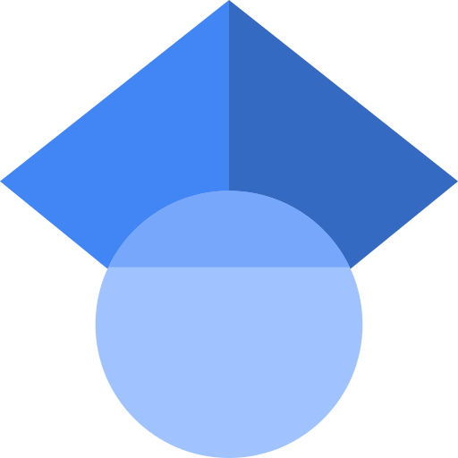
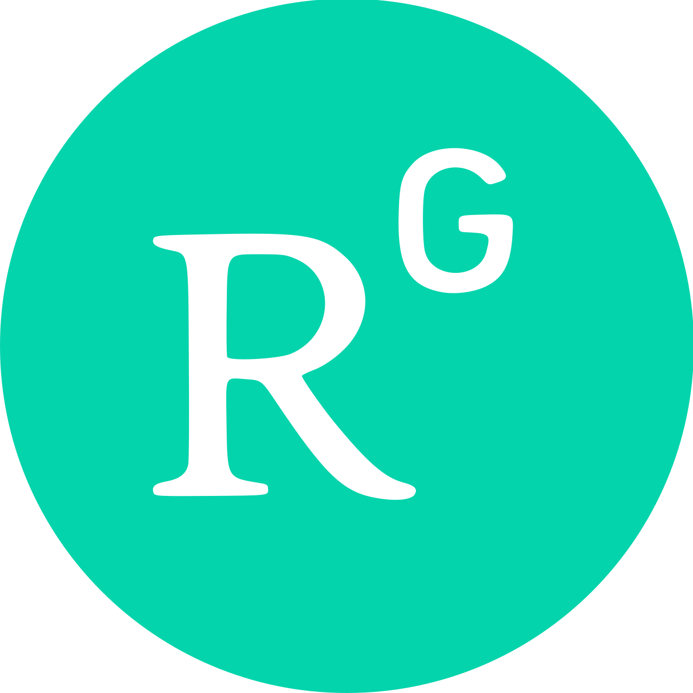
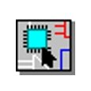
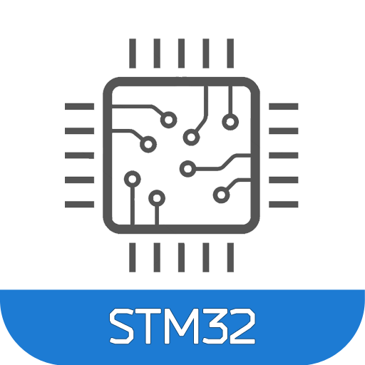

  

###

  

###

<h1 align="center">Hi👋, I'm Muntasir Mamun</h1>
<h3 align="center">Passionate about Electrical Power Systems, Smart Grid and Sustainable Energy Technologies.</h3>

- 🔭 I’m currently working on *MATLAB/Simulink*

- 🌱 I’m currently learning *Machine Learning Concepts*

- 💬 Ask me about *MATLAB/Simulink, Python, Arduino IDE*

- 📫 How to reach me *mamunmuntasir086@gmail.com*

<h3 align="left">Connect with me:</h3>

<h3 align="left">Languages and Tools:</h3>

  

  

  

  

  

  <!-- KiCad -->
  

  <!-- Proteus -->
  

  <!-- AutoCAD -->
  

  <!-- Automation Studio -->
  

  <!-- Multisim -->
  

  <!-- PSpice -->
  

  <!-- STM32 -->
  

###

  

###

<h2>📊 GitHub Stats & Coding Activity</h2>

  <!-- GitHub Stats -->
  <picture>
    <source media="(prefers-color-scheme: dark)"
      srcset="https://github-readme-stats-ranit.vercel.app/api?username=muntasir-mamun086&show_icons=true&theme=radical&hide_border=true&include_all_commits=true&count_private=true&card_width=450" />

  <source media="(prefers-color-scheme: light)"
      srcset="https://github-readme-stats-ranit.vercel.app/api?username=muntasir-mamun086&show_icons=true&include_all_commits=true&count_private=true&card_width=450" />

  
  </picture>

  <!-- Language Activity -->
  <picture>
    <source media="(prefers-color-scheme: dark)"
      srcset="https://github-readme-stats-ranit.vercel.app/api/top-langs?username=muntasir-mamun086&layout=donut&theme=radical&hide_border=true&langs_count=14&size_weight=0.5&count_weight=0.5" />

  <source media="(prefers-color-scheme: light)"
      srcset="https://github-readme-stats-ranit.vercel.app/api/top-langs?username=muntasir-mamun086&layout=donut&langs_count=14&size_weight=0.5&count_weight=0.5" />

  
  </picture>

  

###

<picture data-importer="pacman">
  <source media="(prefers-color-scheme: dark)" srcset="https://raw.githubusercontent.com/muntasir-mamun086/muntasir-mamun086/pacman-output/bomberman-contribution-graph-dark.svg?game=bomberman">
  <source media="(prefers-color-scheme: light)" srcset="https://raw.githubusercontent.com/muntasir-mamun086/muntasir-mamun086/pacman-output/bomberman-contribution-graph.svg?game=bomberman">
  
</picture>

###

  

